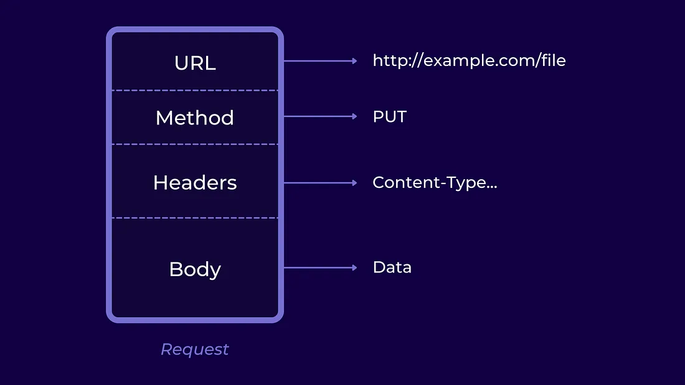

# ¿Cuáles son los tres verbos de API?

## Introducción

Una **API** (Application Programming Interface) es un conjunto de herramientas, protocolos y definiciones que permite a las distintas aplicaciones de software comunicarse entre sí.

Uno de los protocolos más utlizados por APIs hoy en día es el protocolo HTTP, porque es el protocolo principal para comunicaciones por internet. Dado que está tan extendido, y que un gran número de APIs funcionan por internet, este protocolo se ha convertido en estándar para muchas de ellas.

Este protocolo funciona mediante peticiones y respuestas. Es decir, la interacción entre las dos aplicaciones se ejecuta así: la aplicación cliente envía una petición, y la aplicación servidor envía una respuesta.

*Fuente: [Medium](https://medium.com/api-world/api-architecture-the-http-protocol-and-its-importance-aeba0fe46f91)*

Como se puede ver en la imagen, una petición HTTP tendrá un URL, que es el lugar donde está el recurso, un método (el verbo API, que veremos a continuación), encabezados y el cuerpo de la petición, que contiene la información de la misma.

## Verbos de API
Para trabajar con APIs que manejen el protocolo HTTP, necesitamos usar una serie de métodos, también llamados "verbos HTTP" o "verbos de API". Dichos verbos nos ayudan a indicar acciones de solicitud relacionadas con los recursos de la API. Algunos de los más comúnmente usados son GET, POST, PUT y DELETE.

Lo más sencillo es utilizarlos desde alguna herramienta de gestión de APIs como Postman.

### GET
Este verbo sirve para solicitar datos del servidor. Si la petición funciona, la respuesta del servidor contendrá el recurso especificado.

### POST
Con este verbo creamos un elemento y lo subimos al servidor. Si la petición funciona, la respuesta contendrá el URL del nuevo recurso.

### PUT
Con esta acción se puede actualizar alguno de los recursos.

### DELETE
Sirve para eliminar el recurso especificado.