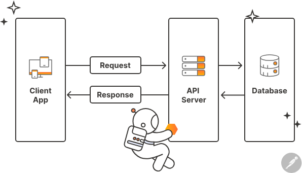

# ¿Qué es una API?

Una **API** (Application Programming Interface o interfaz de programación de aplicaciones) es un conjunto de herramientas, protocolos y definiciones que permite a las distintas aplicaciones de software comunicarse entre sí y compartir datos.

Exiten APIs en todas partes. Cada vez que usamos una app de nuestro teléfono, se está ejecutando una. Al hacerlo, las aplicaciones se conectan a internet y envían datos a un servidor. El servidor recupera los datos, los interpreta, ejecuta las acciones necesarias y los devuelve al teléfono móvil. En ese momento, la app del teléfono interpreta los datos y los presenta de una manera legible para el usuario.

*Fuente: [Postman](https://www.postman.com/api-glossary)*

## ¿Cómo funcionan las APIs?
Para explicar su funcionamiento, es útil hablar en términos de "cliente" y "servidor". Cliente es una aplicación que enviará una solicitud a otra, que actuará como servidor y devolverá los datos.

La respuesta que devuelven los servidores de API son datos sin representación gráfica, al contrario que una página web. Es la app cliente la que interpretará los datos del servidor y los presentará de forma que puedan entenderse bien.

Existen distintos tipos de API. Las más populares actualmente son las de REST (transferencia de estado representacional, de sus siglas en inglés), y usan los verbos de API que hemos visto anteriormente (por ejemplo, GET, PUT, POST, DELETE) para acceder a los datos del servidor.

## Por qué se usan

Son un tipo de software que se ha estandarizado bastante, y se puede controlar y gestionar bien. Tienen un alto grado de seguridad porque, haciendo uso de ellas, los datos quedan protegidos.

Esto funciona así: los datos del teléfono cuya app usamos no se exponen al servidor, y los del servidor tampoco quedan completamente expuestos al teléfono. Estas aplicaciones se comunican compartiendo solo los datos estrictamente necesarios para la operación.

## Ejemplos

El típico ejemplo es el de una app de pronóstico del tiempo. La app del teléfono utilizaría la API de una base de datos de datos meteorológicos, por ejemplo. Esta API accedería a la base de datos y buscaría el pronóstico del tiempo de un lugar determinado. Después, devolvería la información a la app del teléfono rápidamente, y esta mostraría la información al usuario.

Otros ejemplos serían apps de noticias, de productos o servicios determinados... La lista es interminable.