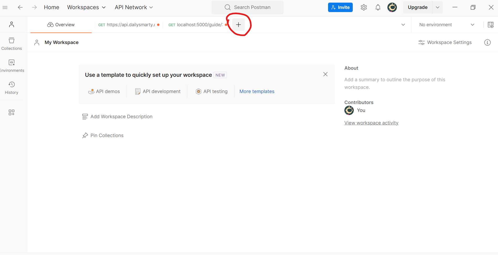
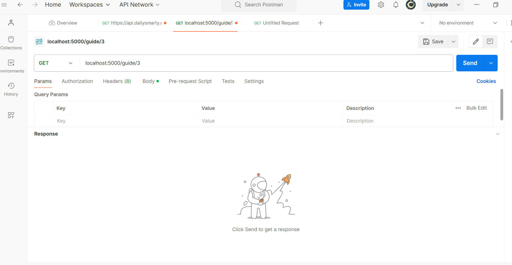
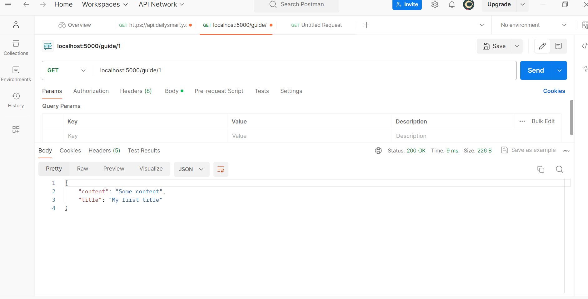

# ¿Qué es Postman?

Es una plataforma de API que permite la gestión de APIs y con la que se pueden crear y usar APIs. Con ella se pueden controlar todos los pasos del ciclo de vida de la API y optimiza la colaboración.

## Cómo crear una solicitud

El uso de Postman es muy sencillo.

1. Desde el espacio de trabajo (My Workspace) se puede crear una nueva solicitud haciendo clic en el el signo +:

2. Se especifica el tipo de verbo y el URL del recurso:

En el ejemplo, se ve una solicitud con verbo GET y URL localhost:5000/guide/3.

3. Hacer clic en `Send`.

4. Devuelve la respuesta del servidor:

Se puede comprobar que el estado de la petición es "200 OK", lo cual quiere decir que ha funcionado.

## Tipos de solicitudes de API

Estas solicitudes tienen que ver con los verbos de API anteriormente explicados. Estos son algunos de los tipos:

- GET: recupera recursos de una API.
- POST: envía recursos a una API.
- PUT: actualiza recursos existentes.
- DELETE: elimina recursos.

## Resultados de solicitudes y códigos de estado

Después de enviar una solicitud, se recibe una respuesta del servidor, que se muestra en el panel inferior. Esta incluye el código de respuesta, el cuerpo y los encabezados.

Existen muchos códigos de estado:

- 100-199: Respuesta de información
- 200-299: Respuestas que han funcionado. En concreto, "200 OK" significa que la solicitud ha funcionado
- 300-399: Redirecciones
- 400-499: Errores del cliente
- 500-599: Errores del servidor