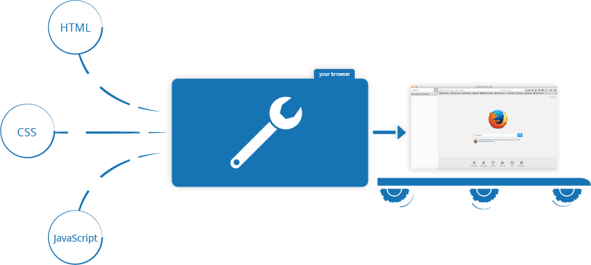

# ¿Qué diferencia a Javascript de cualquier otro lenguaje de programación?

## Introducción

JavaScript es un lenguaje de programación que, en su origen, fue creado para usarlo en páginas web. De hecho, es el único lenguaje de programación que pueden comprender los navegadores de internet y permite implementar funciones complejas a las páginas web, como contenido que se actualiza dinámicamente, mapas interactivos, animaciones, y mucho más.

De hecho, se suele hablar de JavaScript como de un tercer elemento en las páginas web, ya que complementa el código HTML y CSS de una página para añadir el factor interactivo con los usuarios.


*Fuente: [mdn](https://developer.mozilla.org/en-US/docs/Learn/JavaScript/First_steps/What_is_JavaScript)*


Una característica especial de este lenguaje es que sus programas, también llamados *scripts*, se pueden escribir directamente dentro del código HTML y ejecutarse al tiempo que se carga la página.

Ejemplo:
```html
    <div class="link-logo">
        <a href="javascript:void(0);" class="icon" onclick="myFunction()">
        <i class="fa-solid fa-bars"></i>
        </a>
        <a href="#">MyBrand</a>
    </div>
```


## Ejemplos de sintaxis

Declaración de variables:

```JavaScript
var nombre = 'Alex';
```

Comentario de código:

```JavaScript
// Esto es un comentario en JavaScript
var nombre = 'Alex';
```

Objeto de JavaScript:
```JavaScript
var user = { nombre: 'Alex' }
```

Función de JavaScript:

```JavaScript
function hola() {
    console.log('Hola, mundo');
}

hola(); // Imprime: 'Hola, mundo'
```

## Algunas ventajas de JavaScript para los principiantes:

- Es ligero.
- Fácil de aprender gracias a la simplicidad de su estructura, y se ejecuta muy rápido, por lo que es más fácil detectar errores y corregirlos.
- Es rápido: los *scripts* se ejecutan directamente desde el navegador sin necesidad de acceder a un servidor o de usar un compilador.
- Versátil: compatible con otros lenguajes como PHP, Perl y Java.
- Su uso está muy extendido, por lo que es muy popular, y existen un gran número de recursos en línea, por lo que es muy accesible.
- Tiene compatibilidad con muchos otros lenguajes.


*Fuente: [Hostinger](https://www.hostinger.com/tutorials/what-is-javascript#What_Is_JavaScript)*


## Ámbitos

Dónde se usa más:

- en desarrollo web, para aportar comportamiento interactivo a los sitios web: animaciones, modificar la visibilidad del texto, creación de menús desplegables, etc.;
- en desarrollo de aplicaciones móviles y web;
- en desarrollo de videojuegos;
- en desarrollo de servidores web e infraestructura de back-end.


#### [Volver al índice](0.%20Checkpoint_7.md)