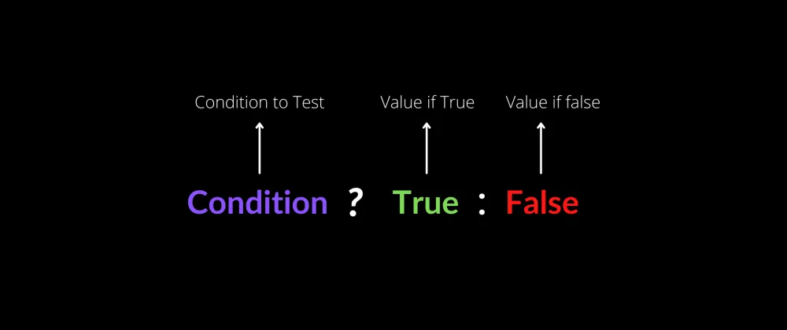

# ¿Qué es un operador ternario?

Es una forma simplificada de expresar condicionales de tipo `if-else`. Permite escribir las condicionales en una sola línea, lo cual es muy práctico al incorporarlo, por ejemplo, a código HTML, que no permitiría su expresión normal de varias líneas.


## Definición

## Usos

## Tipos y sintaxis

Las expresiones con operador ternario más básicas se escriben en tres partes separadas por una interrogación `?` y dos puntos `:`.



*Fuente: [Medium](https://sushantsy.medium.com/mastering-ternary-operators-in-javascript-a-comprehensive-guide-with-interactive-examples-5eab30fca1d0)*

Es decir, se expresan así:

```JavaScript
condición ? expresión_si_se_cumple : expresión_si_no_se_cumple
```

Ejemplo:

```JavaScript
let edad = 25
let permisoConducir = edad >= 18 ? 'Puedes conducir.' : 'No puedes conducir.' // Esta es la expresión con operador ternario
console.log(permisoConducir)
```

Las condicionales compuestas con operador ternario son así:

## Ejemplos
